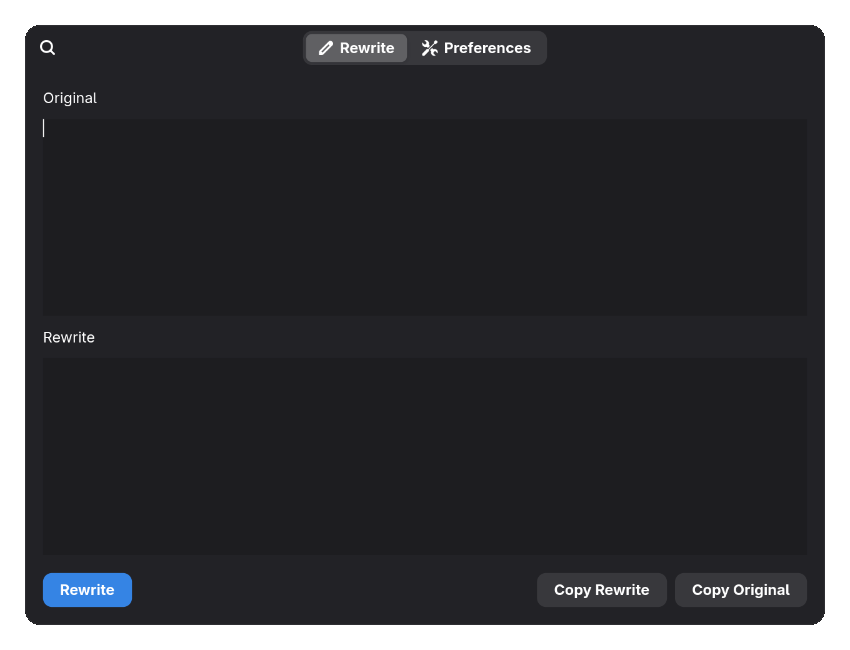
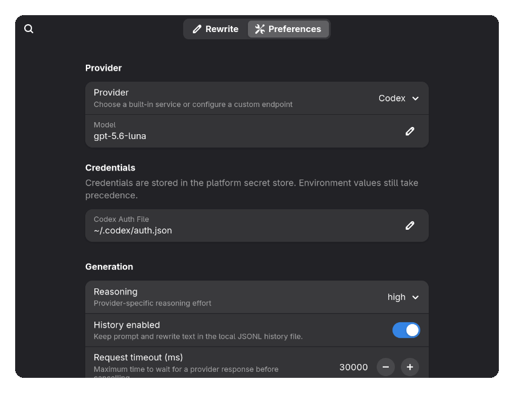

# llm-rewriter

C++20 application for rewriting drafts with an LLM on Linux. The CLI frontend is shared across platforms, with optional GTK4 presentation on Linux and platform-specific runtime services underneath.

## Dependencies

The common CLI build requires:

Arch Linux:

```sh
sudo pacman -S --needed \
    base-devel clang cli11 cmake curl doctest ninja nlohmann-json pkgconf
```

APT-based distributions:

```sh
sudo apt install -y \
    build-essential clang cmake doctest-dev libcli11-dev \
    libcurl4-openssl-dev ninja-build nlohmann-json3-dev pkg-config
```
Other Linux runtime helpers are also optional; install `wl-clipboard`, `wtype`, `xclip`, `xdotool`, `xsel`, or `ydotool` for the input/output paths your desktop provides.

### Credential and notification integration

Arch Linux:

```sh
sudo pacman -S --needed libsecret libnotify
```

APT-based distributions:

```sh
sudo apt install -y libsecret-tools libnotify-bin
```

## Build And Test

Build and test the CLI:

```sh
make build
make test
```

Equivalent CMake flow:

```sh
cmake -S . -B build -G Ninja \
  -DCMAKE_CXX_COMPILER=clang++ -DCMAKE_BUILD_TYPE=Debug -DCMAKE_EXPORT_COMPILE_COMMANDS=ON
cmake --build build
ctest --test-dir build --output-on-failure
ln -sf build/compile_commands.json compile_commands.json
```

## Linux GTK4 UI

Install the GTK4-only dependencies after installing the common CLI packages above:

Arch Linux:

```sh
sudo pacman -S --needed git gobject-introspection gtk4 libadwaita python
```

APT-based distributions:

```sh
sudo apt install -y git gobject-introspection libadwaita-1-dev libgtk-4-dev python3
```

The GTK4 frontend uses the pinned [peel] generator. Initialize its submodule before building:

```sh
git submodule update --init --recursive
```

The generator reads GIR files. On Debian-family systems that install them in an architecture-specific directory, set this path before a GTK4 build:

```sh
export GI_GIR_PATH="/usr/lib/$(gcc -print-multiarch)/gir-1.0:/usr/share/gir-1.0"
```

Build and run the frontend:

```sh
make build GTK4=ON
llm-rewriter-gtk4 --input clipboard
```

[peel]: https://gitlab.gnome.org/bugaevc/peel

### Screenshots

<p align="center">
  
  
</p>

### Desktop installation

Configure and build the GTK4 frontend before installing it:

```sh
make build GTK4=ON
```

For a user-only installation, use `$HOME/.local` as the prefix:

```sh
cmake --install build --prefix "$HOME/.local"
```

This copies the launcher entry to `$HOME/.local/share/applications/llm_rewriter.desktop` and does not require root access. Ensure `$HOME/.local/bin` is in the environment inherited by your desktop session so the launcher's `Exec=llm-rewriter-gtk4 ...` command can find the executable. The install is application-only: it does not copy project headers or a separate backend shared library.

For a system-wide installation, install the same build under `/usr`:

```sh
sudo cmake --install build --prefix /usr
```

This copies the entry to `/usr/share/applications/llm_rewriter.desktop` and the executables to `/usr/bin`. Build as your normal user and use `sudo` only for the install command.

Uninstall the files recorded by the most recent install from this build tree:

```sh
cmake --build build --target uninstall
```

Use `sudo cmake --build build --target uninstall` if that manifest describes a system-wide `/usr` install. The target removes only paths listed in `build/install_manifest.txt`; it does not recursively delete installation directories. Running another install from the same build tree replaces that manifest, so use a separate build directory for each prefix when maintaining user and system installations at the same time.

## CLI Usage

```sh
llm-rewriter doctor
llm-rewriter --input stdin --output stdout --model openai/gpt-5.6-luna
llm-rewriter --input stdin --output clipboard
sleep 2 && llm-rewriter --input primary --output type
llm-rewriter --input clipboard --output paste --ctrl-c-before-output
```

Inputs:

- `clipboard`: normal clipboard text
- `primary`: Linux primary selection; equivalent to the clipboard on Windows
- `stdin`: standard input

Outputs:

- `preview`: require a graphical frontend
- `clipboard`: copy the rewrite
- `stdout`: print the rewrite
- `type`: type with `wtype`, `xdotool`, or `ydotool`
- `paste`: copy the rewrite, then send the configured paste shortcut

`type` and `paste` are best-effort. If synthetic input is unavailable or fails, the rewrite is copied to the clipboard and the fallback is reported.

## Configuration

Linux config defaults to:

```text
${XDG_CONFIG_HOME:-$HOME/.config}/llm-rewriter/config.json
```

Linux history defaults to:

```text
${XDG_DATA_HOME:-$HOME/.local/share}/llm-rewriter/history.jsonl
```

Metadata-only request diagnostics are written alongside history as `diagnostics.jsonl`. They include request IDs, provider/model, HTTP status, provider request IDs when available, duration, and bounded error details; they never include prompts, output, or resolved credentials.

Built-in providers are `openai`, `anthropic`, `gemini`, `openrouter`, and `codex`. The `custom` provider covers local servers (for example Ollama, llama.cpp, or vLLM) and other compatible endpoints without a provider-specific integration.

`custom` exposes the endpoint `base_url`, an `api_format`, and optional JSON headers, query parameters, and request-body overrides. Credentials are optional, so local servers that do not require authentication work without a key. Built-in providers use their well-known endpoints and formats automatically.

Supported API formats:

- `openai_chat`
- `openai_responses`
- `anthropic_messages`

Provider management is explicit:

```sh
printf '%s' "$OPENROUTER_API_KEY" | llm-rewriter providers configure openrouter
llm-rewriter providers status openrouter
llm-rewriter providers clear openrouter
```

Canonical environment variables are fixed: `OPENAI_API_KEY`, `ANTHROPIC_API_KEY`, `GEMINI_API_KEY`, `OPENROUTER_API_KEY`, and `CODEX_ACCESS_TOKEN`.

## License

This project is released under the [MIT License](LICENSE).
